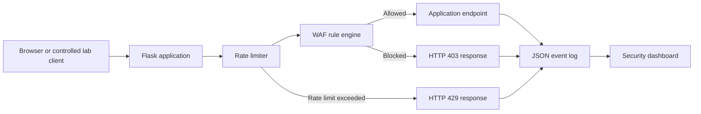

# SentinelShield

SentinelShield is a lightweight educational Web Application Firewall (WAF) and intrusion-detection project. It inspects incoming web requests, detects suspicious indicators, blocks matching requests, logs security events, applies IP-based rate limiting, and displays activity in a dashboard.

> This project is for controlled learning environments only. It is not a production WAF.

## Project purpose

SentinelShield demonstrates the security workflow:

```text
Request → Inspection → Detection decision → Blocking or allowing → Logging → Dashboard analysis
```

## Architecture



## Features

- Inspects requests before endpoints process them.
- Inspects URL paths, query strings, request headers, and POST bodies.
- Detects SQL injection, cross-site scripting, directory traversal, local file inclusion, and command-injection indicators.
- Applies IP-based rate limiting.
- Stores structured JSON Lines security events.
- Displays event totals, categories, IP activity, and recent events in a dashboard.
- Includes automated unit and integration tests.

## Project structure

```text
SentinelShield/
├── app.py                 # Flask application and WAF pipeline
├── waf_rules.py           # Detection signatures and inspection function
├── analytics.py           # Log-summary calculations for the dashboard
├── templates/             # Application and dashboard pages
├── tests/                 # Automated tests
├── docs/                  # Test plan and project documentation
├── logs/                  # Runtime events; not committed to Git
└── requirements.txt       # Python dependencies
```

## Installation

```powershell
git clone https://github.com/sam3084/SentinelShield.git
cd SentinelShield
python -m venv .venv
.\.venv\Scripts\Activate.ps1
python -m pip install -r requirements.txt
```

## Run the application

```powershell
python app.py
```

- Application: `http://127.0.0.1:5000`
- Health check: `http://127.0.0.1:5000/health`
- Security dashboard: `http://127.0.0.1:5000/dashboard`

## Run automated tests

```powershell
python -m unittest discover -s tests -v
```

## Security-event logging

Each request is recorded as one JSON object in `logs/events.jsonl`.

| Field | Meaning |
|---|---|
| `timestamp` | Time recorded in UTC |
| `ip_address` | Direct client IP address in this local lab |
| `method` | HTTP method, such as GET or POST |
| `path` | Requested endpoint |
| `query_string` | URL query parameters |
| `decision` | `allowed` or `blocked` |
| `rule_id` | Identifier of the matched detection rule |
| `category` | Detected threat category |

Request headers and bodies are inspected but deliberately not written to logs, reducing the risk of storing sensitive data.

## Important limitations

- Signature matching cannot detect every attack variation and can create false positives.
- Rate-limit history is in memory and resets when the application restarts.
- The application is deliberately bound to `127.0.0.1` for local-lab safety.
- A production WAF would require stronger rule sets, proxy-aware IP handling, persistent rate-limit storage, authentication, HTTPS, monitoring, and security hardening.

## Future improvements

- Add more carefully tested signatures and evaluate them against a larger labeled dataset.
- Store events in a database.
- Use Redis for rate limiting across multiple application instances.
- Add authentication for dashboard access and exportable reports.
- Measure detection accuracy, false positives, and false negatives with a larger labeled test dataset.
